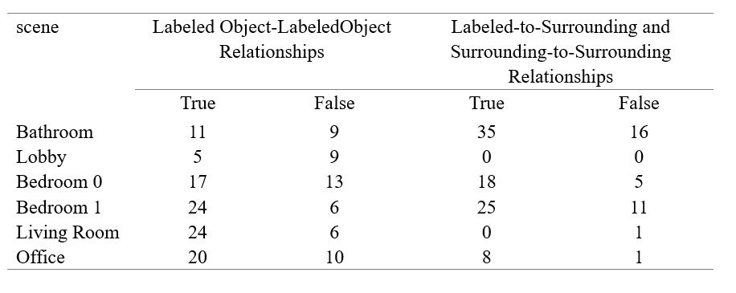

## LicenseAdd commentMore actions

This project is licensed under the GNU Affero General Public License, version 3 (AGPL-3.0-only).  
See the [LICENSE](LICENSE) file for details.  

---
## Project Overview

This repository implements a method for constructing indoor 3D semantic scene graphs from partially labeled point cloud data from 3RScan and 3DSSG_subset. The pipeline consists of four main steps:

1. **Key-Frame Selection**  
   - Apply a pretrained VGG16 to embedding RGB frames, then calculate their similarity using cosine similarity.  
   - Remove frames with high overlap or blurriness.

2. **Data Preprocessing**  
   - Align RGB images with their corresponding depth maps.  
   - Project 3D point-cloud data onto depth images via get_object_frame.py from Open3DSG to extract per-object information in each pair of RGB-D frames (axis-aligned bounding boxes, visibility, etc.).

3. **Object / Object-pair Description**  
   - For each aligned RGB-D frame, collect object labels, IDs, and axis-aligned bounding boxes for object pairs.  
    - Feed this information ( plus the RGB-D images themselves ) into SpatialBot:  
        - When the input is only related to a single object: allow SpatialBot to describe any additional objects it recognizes that are not labeled in the dataset.
        This way we get the relationships between an object and its surrounding objects and these of surrounding objects.
        - When the input is object-pair: only let SpatialBot output the relationships(if exist) between these 2 objects.
        This way we get the relationships between labeled objects. 

4. **Data Cleaning**  
   - Use the moonshot-v1-8k model to summarize the description given by SpatialBot and summarize the final set of semantic relationships in JSON format. 
   - Filter out relationships that contain the string "image".

This approach automatically removes redundant frames, aligns multimodal data, and generates complete semantic descriptions of objects and object pairs in indoor scenes—despite using only partially labeled input.

---
## Result

### (1) Consistency with Annotated Relationships

SpatialBot is not specifically designed for indoor-scene relationship descriptions. This semantic mismatch leads to a large discrepancy between our method’s results and the 3DSSG_subset ground truth (For example, the 3DSSG_subset annotation might read “wall supports ceiling,” whereas SpatialBot outputs “wall is below ceiling.” ), resulting in very low Precision, Recall, and F₁-score.

We evaluated these metrics on the bathroom scene with ID `02b33df9-be2b-2d54-9062-1253be3ce186`. Our method extracted 71 relationships, while the dataset contained 38 annotated relationships for this scene. Only 2 of our extracted relationships matched the annotations exactly. Therefore:

- **Precision** = 2 / 71 = 2.817%  
- **Recall** = 2 / 38 = 5.263%  
- **F₁-score** = 2 · (Precision · Recall) / (Precision + Recall) = 3.670%

### (2) Reliability of Unannotated Relationships

To verify the reliability of relationships that are **not** already annotated in the dataset, we manually inspected six 3RScan scenes. The chosen scenes (with their 3RScan IDs) are:

- Bathroom: `02b33df9-be2b-2d54-9062-1253be3ce186`
- Lobby: `0cac755e-8d6f-2d13-8c6a-c0979ca34a4f`
- Bedroom 0: `02b33e01-be2b-2d54-93fb-4145a709cec5`
- Bedroom 1: `05c6ede7-2e69-23b1-8b27-c1cb868f1938`
- Living Room: `09582205-e2c2-2de1-9475-1cdac7639e60`
- Office: `09582212-e2c2-2de1-9700-fa44b14fbded`

In these scenes, the counts of **labeled** object-object relationships are:

- Bathroom: 20  
- Lobby: 14  
- Bedroom 0: 232  
- Bedroom 1: 292  
- Living Room: 73  
- Office: 58  

Since we extracted many relationships from scenes: Bedroom 0, Bedroom 1, Living Room, and Office, we randomly sampled 30 relationships from each of those four scenes for manual analysis. (Results are summarized in Table below.)

It is worth noting that our method performs poorly in the Lobby scene and fails to extract surrounding-object relationships there—indicating that sparsely populated scenes are a challenge.

We define two metrics:

1. **Average Precision for Labeled_Object-Labeled_Object Relationships**  = number of correctly extracted relationships between labeled objects (across all test scenes) / number of extracted relationships between labeled objects (across all test scenes)

2. **Average Precision for Labeled-to-Surrounding and Surrounding-to-Surrounding Relationships**  = number of correctly extracted Labeled-to-Surrounding and Surrounding-to-Surrounding Relationships (across all test scenes) / number of extracted Labeled-to-Surrounding and Surrounding-to-Surrounding Relationships (across all test scenes)

After calculation, we obtained:

- **Average Precision for Labeled_Object-Labeled_Object Relationships** = 65.584%  
- **Average Precision for Labeled-to-Surrounding and Surrounding-to-Surrounding Relationships** = 71.667%

These results indicate that, despite the low coverage of existing annotations, the system has the potential to discover new semantic relationships from incomplete data.

---
## To run this repo you need to
1. **Set the path of datasets and output files.**

2. **Run bash_files/run_all.sh**

---
## Dependencies & AcknowledgmentsAdd commentMore actions

- **Flan-T5-Base** (Hugging Face Transformers)  
  [![Apache 2.0][apache-badge]](https://www.apache.org/licenses/LICENSE-2.0)  
  SPDX: `Apache-2.0`Add commentMore actions

- **SpatialBot** (BAAI-DCAI)  
  [![MIT][mit-badge]](https://opensource.org/licenses/MIT)  
  SPDX: `MIT`

- **Open3DSG** (Bosch Research)  
  AGPL-3.0-only  
  - Full text: https://www.gnu.org/licenses/agpl-3.0.en.html  
  SPDX: `AGPL-3.0-only`

- **moonshot-v1-8k API**  
  see [Moonshot Terms](https://api.moonshot.ai/terms) for usage and attribution requirements

### Data

- **3RScan**  
  [![MIT][mit-badge]](https://opensource.org/licenses/MIT)  
  SPDX: `MIT`

- **3DSSG**  
  [![CC BY-NC-SA 4.0][ccbyncsa-badge]](https://creativecommons.org/licenses/by-nc-sa/4.0/)  
  SPDX: `CC-BY-NC-SA-4.0`

[apache-badge]:      https://img.shields.io/badge/License-Apache_2.0-blue.svg
[mit-badge]:         https://img.shields.io/badge/License-MIT-green.svg
[ccbyncsa-badge]:    https://img.shields.io/badge/License-CC_BY--NC--SA_4.0-lightgrey.svg